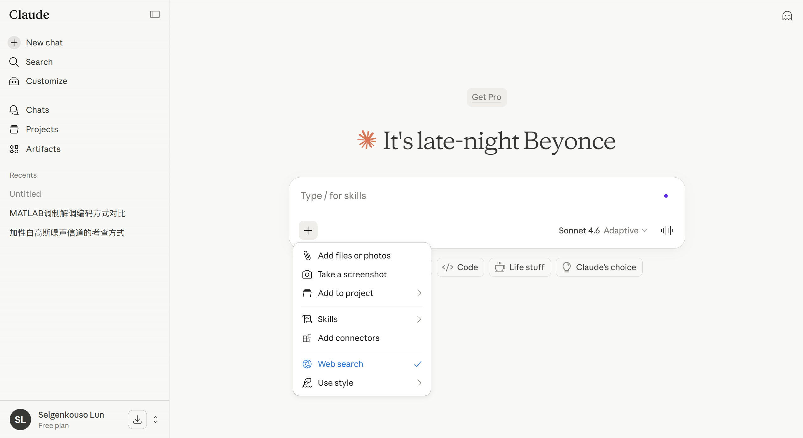
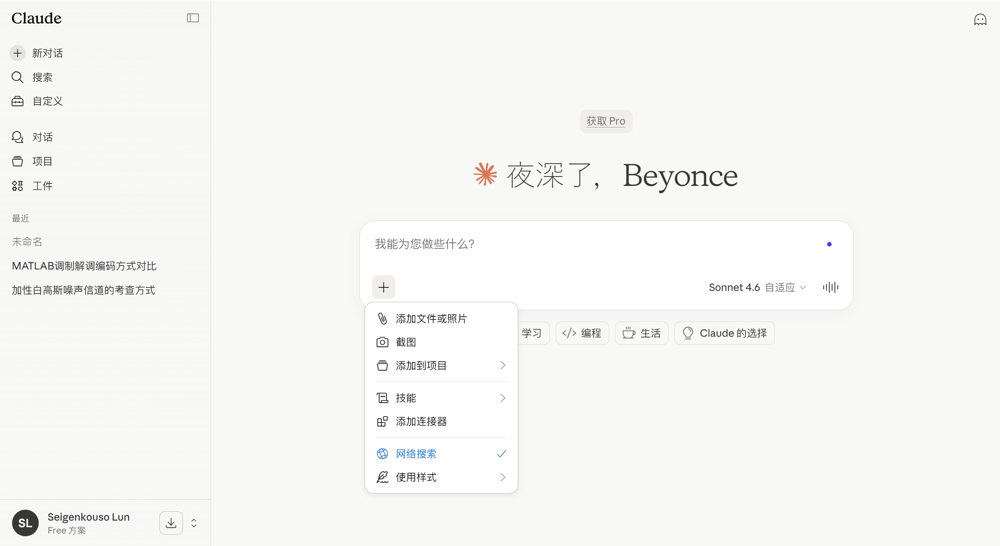

  
  
  
  

  <b>简体中文</b> | <a href="#">繁體中文（暫未推出）</a>

<h1 align="center">Claude-Zh-Plugin (Beta)</h1>

  Claude.ai 汉化插件

---

### 简介

**Claude-Zh-Plugin** 是为 Claude.ai 打造的汉化扩展插件。在不破坏 React 状态和 DOM 事件绑定的前提下，实现了对 Claude 界面（包括 MCP 连接器市场、Cowork 协作空间等）的中文化。

---

### 效果预览

| 汉化前 | 汉化后 |
| :---: | :---: |
|  |  |

---

### 安装方法

本项目目前处于测试阶段，推荐通过“开发者模式”加载使用。

#### Chromium 内核浏览器 (Chrome, Edge, Brave, Arc 等)
1. **获取代码**：克隆仓库或下载 ZIP 压缩包并解压到本地。
2. **进入扩展程序页面**：打开 Chrome 浏览器后，点击界面右上角三点，找到“扩展程序”选项，打开“管理扩展程序”；或者地址栏输入 `chrome://extensions/`（Edge 地址栏输入 `edge://extensions/`）即可。
3. **开启开发者模式**：点击页面右上角的“开发者模式”开关。
4. **加载插件**：点击“加载已解压的扩展程序”，选择本项目所在的文件夹。
5. **刷新页面**：回到 Claude.ai 页面即可看到效果。

#### Firefox 浏览器
1. **获取代码**：下载并解压本项目。
2. **进入调试界面**：地址栏输入 `about:debugging#/runtime/this-firefox`。
3. **加载插件**：点击“加载临时附加组件”，选择本项目目录下的 `manifest.json`。
4. **注意**：Firefox 的临时组件在浏览器重启后会自动卸载。如需长期使用，建议使用 Firefox Developer Edition 或 Nightly 版本进行签名安装。

---

### 词库贡献说明

Claude 的 UI 更新频率极高，单靠个人维护难免有疏漏。如果你发现了未汉化的“死角”，欢迎通过以下方式参与贡献，共同维护本项目：

1. **精准提取**：在未汉化的页面按 `F12` 打开控制台，运行项目 `tools/extractor.js` 中的代码。
2. **提交翻译**：脚本会自动提取当前页面的文本节点。你可以根据输出结果，在 `dictionary.js` 中添加对应的键值对。
3. **发起 PR**：将修改后的词库提交 Pull Request。

您也可以直接通过 Email 提供反馈，反馈邮箱: seeseaamoi@gmail.com（邮件主题请注明 【Claude 插件反馈】）。我们将在空闲时间处理您的问题。

---

### 已知问题

本项目目前仍处于 **Beta 测试阶段**，可能存在以下问题：

* **汉化覆盖率**：目前汉化率并未达到 100%，部分深层菜单或 MCP 插件仍为英文。
* **排版微调**：由于中英文长度差异，部分按钮在汉化后可能出现细微的样式错位。
* **性能损耗**：由于使用了 `MutationObserver` 实时监听 DOM 变动，在处理超长上下文时可能会产生轻微的渲染延迟。
* **浏览器兼容性**：在部分非 Chromium 内核浏览器中，部分 Manifest V3 的特性可能表现不一。

*如果遇到网页卡顿，请尝试禁用插件并提交 Issue，我们会尽快优化 DOM 遍历算法。*

---

### 更新日志

#### [v0.1.1-beta] - 2026-04-21
* **修复**：
    * 修复 `manifest.json` 中缺失的 `version` 字段，修复了在部分浏览器下无法加载扩展程序的严重错误。
    * 修复主页欢迎语未翻译的问题。

#### [v0.1.0-beta] - 2026-04-21
* **初始发布**：
    * 建立核心翻译引擎，支持静态字典与动态正则匹配。
    * 内置 200+ MCP 连接器简介词库。
    * 实现 `Context Overrides` 逻辑，初步解决 `New`、`Enter` 等词汇的语义歧义。

---

### 开源协议

本项目采用 [MIT License](LICENSE) 协议开源。
